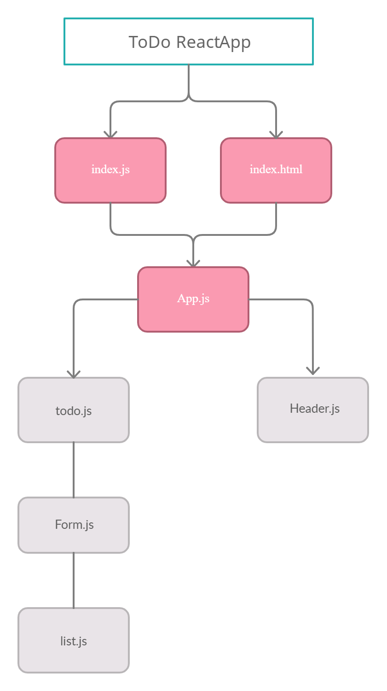

# todo

[gitHub repo](https://github.com/malakMomani/todo)

[Pull request 1](https://github.com/malakMomani/todo/pull/1)

[Pull request 2](https://github.com/malakMomani/todo/pull/5)

[deployed link](https://60cfaeb46d9df77c47b924d7--inspiring-spence-067be7.netlify.app/)

[Context Deployed Link](https://deploy-preview-6--inspiring-spence-067be7.netlify.app/)

UML :

